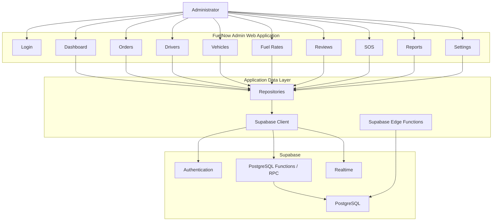
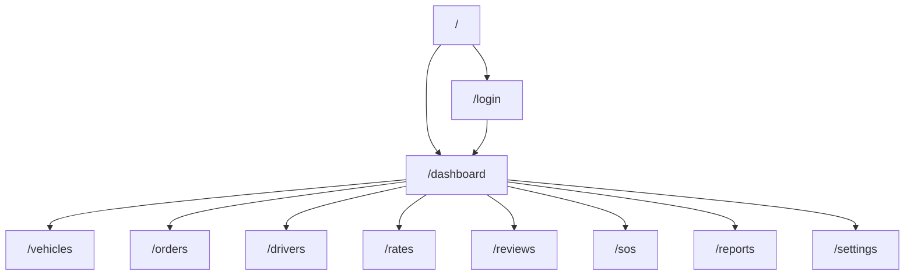
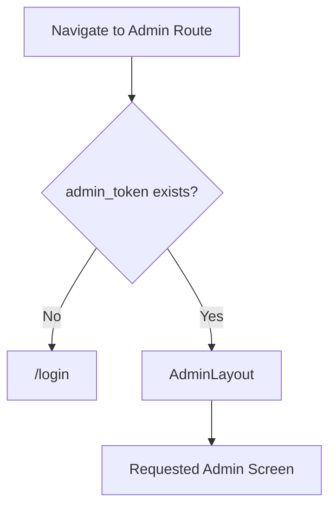
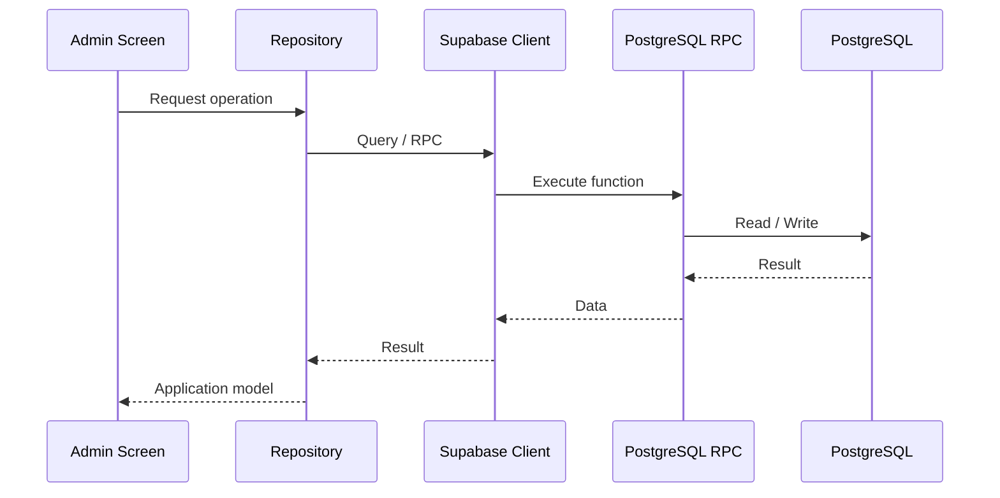
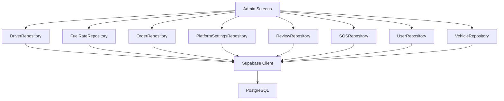
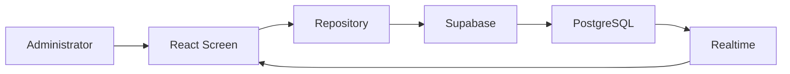
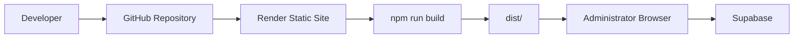
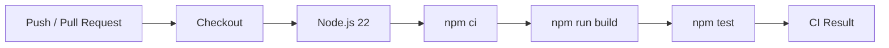
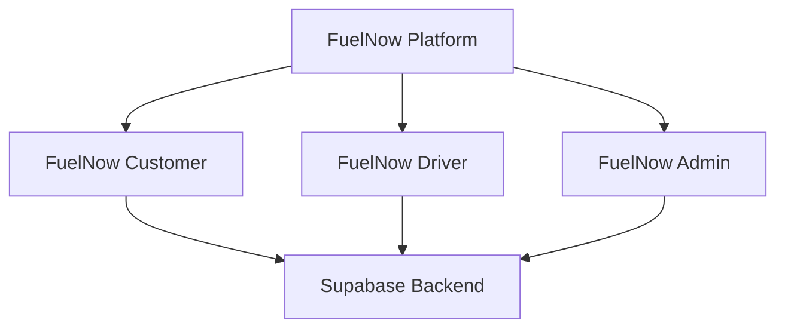

# FuelNow Admin

The FuelNow Admin application is the web-based administration platform for the FuelNow fuel delivery system.

Administrators use the application to monitor orders, manage drivers, manage vehicles, configure fuel rates, review customer feedback, handle SOS incidents, generate reports, and manage platform settings.

The application is built with React, TypeScript, and Vite and uses Supabase as its backend platform.

---

## 1. Application Overview



---

## 2. Technology Stack

| Technology        | Purpose                                   |
| ----------------- | ----------------------------------------- |
| React             | Web UI                                    |
| TypeScript        | Static typing                             |
| Vite              | Development server and production bundler |
| React Router      | Client-side routing                       |
| Supabase JS       | Backend/database access                   |
| PostgreSQL        | Persistent data                           |
| Supabase RPC      | Database operations                       |
| Supabase Realtime | Live updates                              |
| Leaflet           | Maps                                      |
| Leaflet Heat      | Heat-map visualisation                    |
| XLSX              | Spreadsheet/report processing             |
| Oxlint            | Linting                                   |
| Vitest            | Unit testing                              |

---

## 3. Project Structure

```text
FuelNow-Admin/
│
├── public/
│
├── src/
│   ├── assets/
│   │
│   ├── components/
│   │
│   ├── patterns/
│   │
│   ├── repositories/
│   │   ├── DriverRepository.ts
│   │   ├── FuelRateRepository.ts
│   │   ├── OrderRepository.ts
│   │   ├── PlatformSettingsRepository.ts
│   │   ├── ReviewRepository.ts
│   │   ├── SOSRepository.ts
│   │   ├── UserRepository.ts
│   │   └── VehicleRepository.ts
│   │
│   ├── screens/
│   │   ├── DashboardScreen.tsx
│   │   ├── DriversScreen.tsx
│   │   ├── LoginScreen.tsx
│   │   ├── OrdersScreen.tsx
│   │   ├── RatesScreen.tsx
│   │   ├── ReportsScreen.tsx
│   │   ├── ReviewsScreen.tsx
│   │   ├── SOSScreen.tsx
│   │   ├── SettingsScreen.tsx
│   │   └── VehiclesScreen.tsx
│   │
│   ├── services/
│   │   └── supabase.ts
│   │
│   ├── types/
│   │
│   ├── App.css
│   ├── App.tsx
│   ├── index.css
│   └── main.tsx
│
├── index.html
├── package.json
├── package-lock.json
├── tsconfig.json
├── tsconfig.app.json
├── tsconfig.node.json
├── vite.config.ts
└── vitest.config.ts
```

---

## 4. Application Routing

The Admin application uses React Router.



Available routes:

```text
/login
/dashboard
/vehicles
/orders
/drivers
/rates
/reviews
/sos
/reports
/settings
```

Unknown routes redirect to `/`.

---

## 5. Authentication

The Admin application uses an application-level admin session token.

Authentication state is represented by:

```text
localStorage["admin_token"]
```

A session marker is stored using:

```text
sessionStorage["fuelnow_admin_session"]
```

When a new browser session begins, the application clears the previous `admin_token`.

---

## 6. Protected Routes

Administrative routes are protected by `ProtectedRoute`.



Protected functionality includes:

```text
Dashboard
Vehicles
Orders
Drivers
Rates
Reviews
SOS
Reports
Settings
```

---

## 7. Backend Architecture

The Admin application communicates directly with Supabase.



---

## 8. Supabase Configuration

The Admin application reads configuration from Vite environment variables.

```env
VITE_SUPABASE_URL=your_supabase_url
VITE_SUPABASE_ANON_KEY=your_supabase_anon_key
```

The configuration is implemented in:

```text
src/services/supabase.ts
```

The application validates that both variables exist during startup.

---

## 9. Repository Architecture

The Admin application separates database access into repositories.



---

## 10. Core Administrative Modules

### Dashboard

Provides a central operational overview of FuelNow activity.

Typical dashboard information includes:

```text
Orders
Completed orders
Revenue
Drivers
Operational activity
Alerts
```

---

### Orders

The Orders module provides administrative visibility into customer orders.

Responsibilities include:

* Viewing orders
* Inspecting order information
* Monitoring order statuses
* Viewing assigned driver information
* Monitoring delivery activity

Primary repository:

```text
src/repositories/OrderRepository.ts
```

---

### Drivers

The Drivers module manages driver information.

Responsibilities include:

* Driver records
* Driver profiles
* Driver status
* Driver compliance information
* Driver-related operational data
* Driver activity

Primary repository:

```text
src/repositories/DriverRepository.ts
```

---

### Vehicles

The Vehicles module manages the platform's delivery vehicles.

Responsibilities include:

* Vehicle records
* Registration numbers
* Vehicle make/model
* Fuel capacity
* Driver assignment
* Vehicle editing
* Vehicle creation

Primary repository:

```text
src/repositories/VehicleRepository.ts
```

---

### Fuel Rates

The Rates module manages fuel pricing information.

Primary repository:

```text
src/repositories/FuelRateRepository.ts
```

---

### Reviews

The Reviews module allows administrators to inspect customer feedback and manage review status.

Primary repository:

```text
src/repositories/ReviewRepository.ts
```

---

### SOS

The SOS module provides operational visibility over emergency incidents.

Primary repository:

```text
src/repositories/SOSRepository.ts
```

---

### Reports

The Reports module provides administrative reporting functionality.

Reports can use data such as:

```text
Orders
Completed orders
Cancelled orders
Fuel volume
Revenue
Reviews
Average review rating
SOS incidents
```

Spreadsheet functionality is supported through:

```text
xlsx
```

---

### Settings

The Settings module manages platform-level configuration.

Primary repository:

```text
src/repositories/PlatformSettingsRepository.ts
```

User administration is supported through:

```text
src/repositories/UserRepository.ts
```

---

## 11. Administrative Data Flow



---

## 12. Edge Functions

The Supabase service wrapper also supports Supabase Edge Functions through:

```text
POST /functions/v1/{functionName}
```

Requests use:

```http
Content-Type: application/json
Authorization: Bearer <SUPABASE_ANON_KEY>
apikey: <SUPABASE_ANON_KEY>
```

The generic invocation method is:

```text
supabaseService.invokeFunction(functionName, body)
```

This allows server-side operations to be invoked without placing server-only logic directly into the browser.

---

## 13. Client-Side Endpoint Model

The Admin application does not use a traditional Express/Node REST server.

Its effective backend interface consists of:

```text
Supabase Client
    │
    ├── PostgreSQL queries
    ├── PostgreSQL RPC functions
    ├── Supabase Realtime
    └── Supabase Edge Functions
```

Therefore, database operations should be documented according to their repository method and underlying Supabase operation rather than inventing REST URLs that do not exist.

---

## 14. Deployment Architecture

The Admin application is a Vite static web application.



---

## 15. Production Build

Install dependencies:

```bash
npm ci
```

Build:

```bash
npm run build
```

The build performs:

```text
tsc -b
    ↓
vite build
    ↓
dist/
```

The Vite production output directory is:

```text
dist
```

---

## 16. Render Deployment

For a Render Static Site deployment:

```text
Root Directory:
[repository root]

Build Command:
npm install && npm run build

Publish Directory:
dist
```

Because React Router is used, the deployment should provide an SPA rewrite:

```text
/* → /index.html
```

This ensures direct navigation to routes such as:

```text
/dashboard
/orders
/drivers
```

continues to resolve correctly.

---

## 17. Testing

Unit tests are implemented using Vitest.

Run tests:

```bash
npm test
```

Watch mode:

```bash
npm run test:watch
```

Coverage:

```bash
npm run test:coverage
```

TypeScript and production build validation:

```bash
npm run build
```

Linting:

```bash
npm run lint
```

---

## 18. CI/CD

The Admin application uses GitHub Actions to validate changes.



The production build is deliberately included because it validates both:

```text
TypeScript compilation
Vite production bundling
```

before the application is considered ready.

---

## 19. Security

The browser application uses:

```text
VITE_SUPABASE_URL
VITE_SUPABASE_ANON_KEY
```

The anonymous Supabase key is designed for client-side use.

The following must never be included in the frontend:

```text
Supabase service-role key
Database passwords
Private API secrets
Payment private keys
Server-side credentials
```

Authorization must be enforced by Supabase authentication, Row Level Security, database functions, and server-side Edge Functions where appropriate.

Client-side route protection should not be treated as the only security boundary.

---

## 20. Administrative Responsibilities

The Admin application is responsible for:

* Administrator authentication
* Operational dashboard
* Order management
* Driver management
* Vehicle management
* Fuel rate management
* Review management
* SOS incident management
* Reporting
* Platform settings
* Operational monitoring
* Driver activity visibility
* Fleet information

It is not responsible for:

* Customer mobile ordering UI
* Driver mobile workflow
* Native driver GPS tracking
* Customer mobile authentication UI
* Customer-side payment UI

Those responsibilities belong to the Customer and Driver applications.

---

## 21. Application Architecture

```text
React Components
       ↓
Screens
       ↓
Repositories
       ↓
Supabase Client
       ↓
┌─────────────────────────────┐
│ PostgreSQL                  │
│ RPC Functions               │
│ Realtime                    │
│ Edge Functions              │
└─────────────────────────────┘
```

The application intentionally keeps database operations inside repository classes rather than embedding database logic throughout the UI.

---

## 22. Development Workflow

Recommended local workflow:

```bash
npm ci
npm run build
npm test
npm run lint
```

Development server:

```bash
npm run dev
```

Preview the production build:

```bash
npm run preview
```

---

## 23. Repository Responsibilities

The Admin repository contains only the web administration application.

The Customer repository contains the customer mobile application.

The Driver repository contains the driver mobile application.

Together they form the FuelNow application suite:



The three applications share the same backend data platform while providing separate interfaces and responsibilities.
